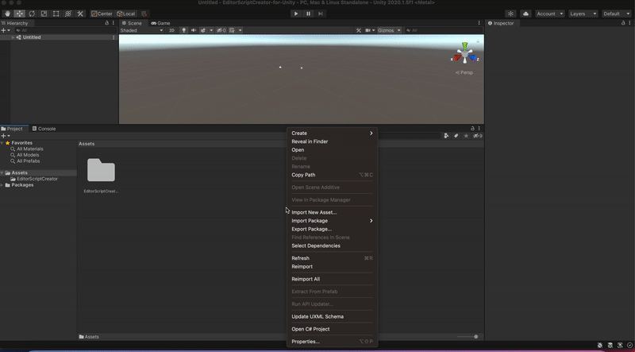

# EditorScriptCreator

**EditorScriptCreator** - is a super-simple tool for fast creating templates for [Editor](https://docs.unity3d.com/ScriptReference/Editor.html) script!

## Pros and Cons

### Pros
- Easy to use;
- Simple code, easy to modify;
### Cons
- Made too straightforward, a lot of things aren't checked; 
- AsmDefs are not supported;

## Installation

- Copy `EditorScriptCreator` to your project;
- Enjoy!

## How to use

